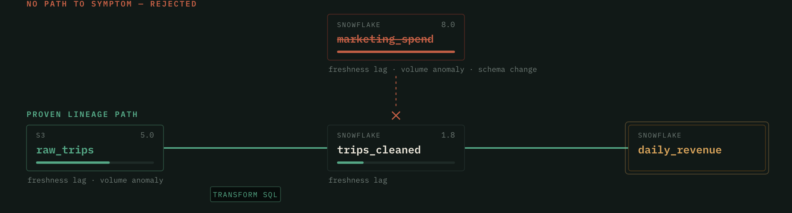

# Cauzon

**Every root cause, proven from the source.**

Cauzon is a path-grounded root-cause analysis agent for data incidents, built on
[DataHub](https://datahub.com). When an assertion fails, it walks the lineage
graph **upstream**, ranks candidate culprits from multimodal signals, and names a
root cause **only when it can reconstruct the exact lineage path** connecting
that cause to the symptom. Then it files the dossier back into the catalog, so
the next person — or agent — inherits the answer instead of re-deriving it.

> Built for **Build with DataHub: The Agent Hackathon** — *Agents That Do Real
> Work*.



**That image is the whole argument.** `marketing_spend` is the most suspicious
asset in the graph — two days stale, 88% of its rows gone, a column renamed four
hours ago — and it ranks first at 8.0. Cauzon throws it out, because no lineage
edge connects it to the symptom. The real origin is `raw_trips` at 5.0, two hops
upstream, and that one it proves: path reconstructed from real edges, plus the
transform SQL that carried the fault downstream.

A ranking is a hypothesis. A path is proof.

## Why this is different

Commercial data-observability tools **alert** you that something broke. They do
not autonomously **localize the cause** by traversing lineage, and they never show
you a verifiable proof path. The failure mode of every ranked-suspect approach is
a confident, well-scored, wrong answer — and a diagnosis nobody can audit is
worse than no diagnosis, because someone acts on it.

Cauzon separates ranking from proving, and lets the second step veto the first.

### Grounding is a ladder, not a boolean

Every finding states its own rung:

| Level | Meaning |
| --- | --- |
| `PATH_AND_TRANSFORM` | Lineage path reconstructed **and** the transform that carried the fault captured |
| `PATH_ONLY` | Path reconstructed, but DataHub retains no query history for the causal edge. Confidence drops; the dossier says so |
| `UNGROUNDED` | Nothing connects the suspect to the symptom. No cause is named and nothing is written |

Requiring transform SQL absolutely would look rigorous and be useless — real
instances frequently have no query history. An artifact that declares its own
epistemic status is both more honest and more useful than one that overclaims.

### Confidence you can audit

Confidence is a product of three named factors, each reported with its reason:

```
confidence = grounding_factor × signal_factor × origin_factor

grounding: PATH_AND_TRANSFORM 1.0 | PATH_ONLY 0.75 | UNGROUNDED 0.0
signals:   0.55 + 0.15 × distinct_signals, capped at 1.0
origin:    1.0 if no upstream carries the fault, else 0.7 (may be inherited)
```

Every number the UI shows traces back to one of these.

### The write-back is a loop, not a gesture

Cauzon files each dossier with `save_document` — and reads prior dossiers back
with `search_documents` on the next investigation. On the third stall of the same
ingestion job, the recommendation stops being "backfill this window" and becomes
"the schedule is the defect." The knowledge compounds.

## Grounded in current research

- **RCRank** (VLDB 2025) — multimodal ranking beats a single anomaly score.
- **PAVE / OpenRCA 2.0** — the *ungrounded diagnosis* problem: a correct cause
  with an unverified path is unacceptable.
- **DeepRoot** (ICML 2026) — separate *grounding* from *reasoning* to cut
  hallucination. Implemented literally: the proof gate is deterministic code, and
  the optional Claude layer only ever explains a verdict that is already settled.
  It receives nothing ungrounded, cannot reach any decision field, and its output
  is discarded if it invents a URN.

## The investigation loop

| Phase | What Cauzon does | DataHub tools |
| --- | --- | --- |
| **Detect** | Pick up a failing assertion / incident | `search`, incidents |
| **Scope** | Pull the minimal upstream subgraph (≤3 hops) | `get_lineage` |
| **Hypothesize** | Rank on freshness lag, volume anomaly, schema change, key fanout. A node scores as the *origin* when it carries the fault and none of its upstreams do | `get_entities`, `list_schema_fields` |
| **Prove** | Reconstruct the path from real edges; capture the transform SQL | `get_lineage_paths_between`, `get_dataset_queries` |
| **File** | Persist the dossier, tag the culprit, note the owner, read prior dossiers | `save_document`, `add_tags`, `update_description`, `search_documents` |

## Quickstart

Cauzon ships a **mock backend** with three planted faults, so the whole app runs
with zero infrastructure.

```bash
# Agent + API
python3 -m pip install -e .
uvicorn backend.main:app --port 8000

# Or straight from the terminal
PYTHONPATH=agent python3 -m cauzon.cli
PYTHONPATH=agent python3 -m cauzon.cli --scenario fanout --no-writeback
```

```bash
# Web UI (also an installable mobile PWA)
cd frontend
npm install
npm run dev            # http://localhost:3000
```

The UI works **without the backend running** — it replays recorded runs of the
real agent in the browser, which is how the deployed demo functions. Set
`NEXT_PUBLIC_CAUZON_API` to point it at a live backend.

### The three scenarios

Each plants a fault a *different* signal has to catch, which is the point: the
framework is not tuned to one demo.

| `--scenario` | Fault | Why it needs its own signal |
| --- | --- | --- |
| `freshness` (default) | Ingestion stalled two days ago; staleness propagates downstream | Also carries the ungroundable decoy that outranks the real cause |
| `schema_change` | `amount` renamed to `order_amount`; the downstream transform still selects `amount` | Nothing is stale — no freshness or volume alert would fire |
| `fanout` | A dimension table gains duplicate keys, so every join multiplies rows | Nothing is stale and nothing changed shape; only key uniqueness finds it |

## Running against a real DataHub

```bash
pip install -e ".[datahub]"
export CAUZON_DATAHUB_BACKEND=mcp
export DATAHUB_GMS_URL=http://localhost:8080
export DATAHUB_TOKEN=<personal access token>   # Settings → Access Tokens
```

Write-back tools (`add_tags`, `update_description`, `save_document`) require the
MCP server to run with `TOOLS_IS_MUTATION_ENABLED=true`. `MCPDataHubClient`
normalises every MCP response into the same shape the mock returns, so the agent
logic is identical across backends.

**Verified live.** The MCP backend has been smoke-tested against a real
`datahub docker quickstart` with the `showcase-ecommerce` datapack — `search`,
`get_entity`, `list_schema_fields`, `get_lineage` and `get_dataset_queries` all
return real catalog data:

```bash
python scripts/mcp_smoke_test.py
```

A full grounded investigation **with write-back** has also been run end to end:

```bash
python scripts/ingest_demo_lineage.py   # plant raw_trips -> trips_cleaned -> daily_revenue
python scripts/run_live_writeback.py    # investigate and write the results back
```

That produced, on the live catalog: `globalTags` on `raw_trips`
(`root-cause`, `cauzon-diagnosed`), an updated
`editableDatasetProperties.description`, and a `Document` entity holding the full
dossier. The aspects read back out of the running instance afterwards are in
[`examples/live-proof/`](./examples/live-proof/).

Two robustness details worth noting, both handled by `MCPDataHubClient`:

- **Tag auto-creation** — DataHub rejects applying a tag whose entity does not
  exist, so `add_tags` emits a minimal `tagProperties` aspect first.
- **Graph-index-independent lineage** — the lineage *search* API depends on the
  graph index, which can lag or stall on a constrained quickstart. When it
  returns nothing, Cauzon walks the durable `upstreamLineage` aspects directly,
  so RCA still works.

> If GMS on `:8080` looks unreachable, check that nothing else is bound to port
> 8080 before running `datahub docker quickstart`.

## Configuration

| Env var | Default | Meaning |
| --- | --- | --- |
| `CAUZON_DATAHUB_BACKEND` | `mock` | `mock` (planted faults) or `mcp` (real DataHub) |
| `CAUZON_MOCK_SCENARIO` | `freshness` | `freshness`, `schema_change`, or `fanout` |
| `DATAHUB_GMS_URL` | `http://localhost:8080` | GMS endpoint (`mcp` backend) |
| `DATAHUB_TOKEN` | — | DataHub personal access token (`mcp` backend) |
| `CAUZON_CORS_ORIGINS` | `*` | Allowed CORS origins for the API |
| `CAUZON_LLM_NARRATION` | off | Set to `1` to let Claude write the dossier narrative |
| `CAUZON_LLM_MODEL` | `claude-opus-5` | Model for the narration layer |
| `NEXT_PUBLIC_CAUZON_API` | `http://localhost:8000` | Backend the frontend talks to |

Narration is **opt-in** and needs `pip install -e ".[llm]"` plus an
`ANTHROPIC_API_KEY`. Without it — the default — Cauzon uses deterministic
templates, so tests are hermetic and a demo cannot fail on a network call.

## Tests

```bash
pip install -e ".[dev]"
pytest -q          # 45 tests
```

The suite is deliberately adversarial about the central claim: a hostile narrator
cannot flip the verdict, a path without transform SQL downgrades instead of
overclaiming, an evidence-free graph produces no write-back at all, and the
better-scoring decoy must be rejected rather than blamed.

## Open-source contribution

[`contrib/datahub-skills-pr/`](./contrib/datahub-skills-pr/) is a ready-to-PR
**DataHub Skill** (`datahub-rca`) that teaches any MCP-connected agent — Claude
Code, Cursor, Gemini CLI — to perform path-grounded RCA. It is formatted to match
the conventions of
[`datahub-project/datahub-skills`](https://github.com/datahub-project/datahub-skills),
verified against that repo's `datahub-lineage` skill and `CONTRIBUTING.md`.

It is scoped deliberately against the existing `datahub-lineage` skill: that one
*traverses* lineage, this one *adjudicates* it — adding the proof gate, the
grounding ladder, and the dossier write-back.

## Repository layout

```
cauzon/
├── agent/cauzon/              # the agent core (framework-agnostic, no LLM required)
│   ├── agent.py               # detect → scope → hypothesize → prove → file
│   ├── datahub_client.py      # MCP client + mock backend with three planted faults
│   ├── reasoner.py            # optional Claude narration, structurally unable to decide
│   ├── models.py              # grounding ladder, confidence factors, proof path
│   └── cli.py
├── backend/main.py            # FastAPI + WebSocket live trace
├── frontend/                  # Next.js app — landing page + the investigation UI
│   ├── components/LineageSpine.tsx   # the proof, drawn as geometry
│   └── lib/fixtures.json      # recorded agent output, replayed in the browser
├── contrib/datahub-skills-pr/ # ready-to-PR DataHub Skill
├── demo/                      # video script, submission text, CLI transcript
├── examples/                  # real Cauzon-generated dossiers + live write-back proof
├── scripts/                   # fixture/example generators, live smoke tests
└── tests/                     # deterministic tests over the planted faults
```

`examples/` and `frontend/lib/fixtures.json` are **generated** from real agent
runs, and CI fails if they drift:

```bash
PYTHONPATH=agent python scripts/build_examples.py
PYTHONPATH=agent python scripts/build_fixtures.py
```

## License

Apache-2.0. See [LICENSE](./LICENSE).
